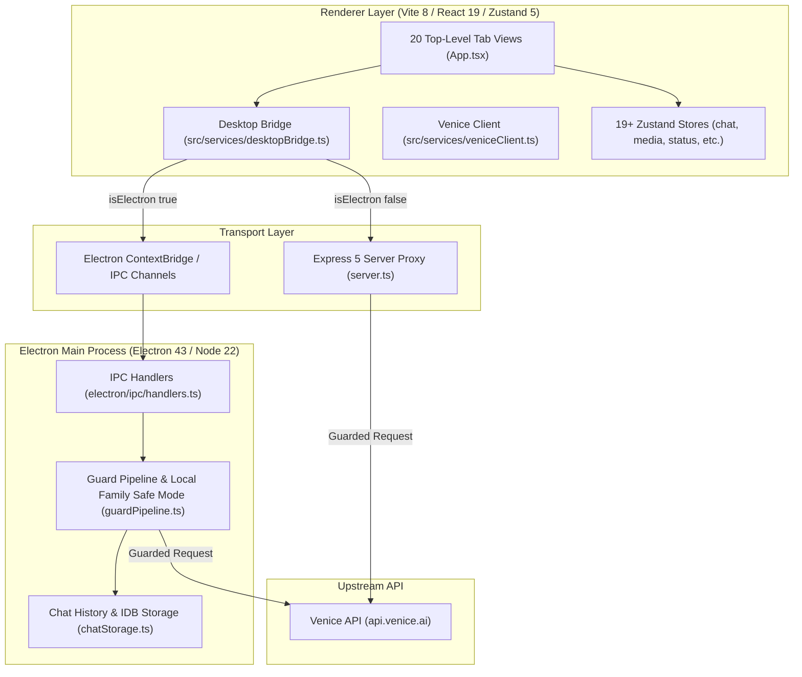

# Venice Forge — Codebase Re-Initialization & Context Handoff

> **Canonical Repository Root:** `/Users/super_user/Projects/Venice_Forge`  
> **GitHub:** `spearchucker667/Venice_Forge`  
> **Version:** `3.0.0-beta.1`  
> **Last Re-Initialization:** 2026-07-21 (Anchored to git commit `27aca76`)  
> **Audience:** Senior Engineers & AI Coding Agents joining the project.

---

## 1. Current High-Level Architecture & Mental Model `[VERIFIED]`

Venice Forge is a desktop-first (**Electron 43**) and web-compatible (**Vite 8 + Express 5**) multi-modal AI workspace client for the Venice.ai API. It enables privacy-focused AI chat, RP character design, image/video generation, prompt/scene composition, and document-assisted research.

### Core Architecture & Transports
- **Dual Transport System:**
  - **Electron Desktop (`isElectron() === true`):** Renderer (Vite 8 / React 19) $\rightarrow$ ContextBridge (`window.veniceForge`) $\rightarrow$ Preload (`electron/preload.ts`) $\rightarrow$ Main IPC Handlers (`electron/ipc/handlers.ts`) $\rightarrow$ Upstream Venice API (`api.venice.ai`). API keys and secrets are secured in OS-native `safeStorage` via `providerSettingsStore`.
  - **Web Proxy (`isElectron() === false`):** Renderer $\rightarrow$ Express 5 Proxy Server (`server.ts` at `/api/venice/*`) $\rightarrow$ Upstream Venice API (`api.venice.ai`). API keys read from `.env` or ephemeral session memory.
- **Single Dispatch Bottleneck:** All Venice HTTP requests MUST flow through `veniceFetch()` / `veniceStreamChat()` in `src/services/veniceClient.ts`. Direct `fetch('/api/venice/...')` or direct `window.veniceForge.*` calls outside of `src/services/desktopBridge.ts` are strictly forbidden (`VERIFY-009`).



### Core Invariants & Data Flow
1. **Local Family Safe Mode Runtime Snapshot (`VERIFY-015`):** Main-process `runtimeSafetySettings` is authoritative for safety. All Venice-touching IPC handlers pass through `performGuardedVeniceRequest()` and `checkLocalFamilyGuard()` in `electron/services/guardPipeline.ts`. Web proxy defaults safety to ON unless overridden by `VENICE_FORGE_LOCAL_FAMILY_SAFE_MODE_ENABLED`. Blocked responses emit HTTP 451: `{ ok: false, status: 451, body: { error, reasonCode, category, severity } }`.
2. **Canonical Tab Registry (`VERIFY-022`):** `src/config/tabs.ts` is the sole source of truth for tab IDs (`TAB_IDS`), descriptors (`TAB_REGISTRY`), visible order (`CANONICAL_TAB_ORDER`), and sidebar groups.
3. **Zustand 5 Slice Stores:** Reactive application state lives in slice stores under `src/stores/`. Core app state: `auth`, `chat`, `playground`, `settings`, `toast`, `workflow`, `status`. Content libraries: `media`, `project`, `prompt-library`, `scene-composer`, `scenario`, `character-card`, `character`, `persona`, `lorebook`, `rp-chat`, `scene-asset`, `workflow-template`, `image-workspace`. Utilities: `storage-privacy`, `research`, `media-selection`, `inspector`, `config`.

---

## 2. Key Domain Concepts & Business Logic `[VERIFIED]`

- **Model-Aware Generation Recipes (`VERIFY-043`):** `GenerationRecipe` encapsulates image/video generation parameters (model, prompt, negative prompt, aspect ratio, resolution, seed, cfg, steps, style). Model capabilities are declared in `src/config/image-model-capabilities.ts`. `getRecipeCompatibilityReport()` checks parameter compatibility; unsupported parameters are dropped at the network boundary before dispatch.
- **Roleplay (RP) Studio Engine (`VERIFY-048`):** Combines `PersonaV1`, `CharacterCardV1`, `ScenarioV1`, and `LorebookV1` using `compileRpPromptStack()` in `src/services/rpPromptCompiler.ts`. Token estimates are displayed via `rpTokenCounter`, and character cards support V2 PNG chunk metadata and safety wrappers.
- **Prompt Library & Scene Composer (`VERIFY-046`, `VERIFY-047`):** IndexedDB stores `promptLibrary` (v8) and `scenes` (v9) store append-only version chains (`PromptVersion`, `SceneVersion`). `compileSceneToRecipe` assembles scene components in canonical order (`subject` $\rightarrow$ `character` $\rightarrow$ `location` $\rightarrow$ `mood` $\rightarrow$ `style` $\rightarrow$ `camera` $\rightarrow$ `lighting` $\rightarrow$ `composition` $\rightarrow$ `note`).
- **Managed Document Agent (`VERIFY-058`):** Bounded chat agent execution loop (`MAX_AGENT_TURNS = 8`, `MAX_AGENT_TOOL_CALLS = 16`). Universal attachment pipeline classifies, parses, redacts secrets, and wraps documents (PDF, DOCX, CSV, code, text) with XML escaping.
- **Media Studio Power Tools (`VERIFY-044`):** Zustand store `media-selection-store` caps multi-select at `MEDIA_SELECTION_MAX = 4`. Supports multi-select compare, lineage graph tracing (`parentId` $\rightarrow$ `childrenIds`), bulk project assignment/tagging, and safe export bundles.

---

## 3. Major Recent Changes & Architectural Decisions `[VERIFIED]`

All entries sourced from repository git commit history (July 2026):

| Change | ISO Date / Commit | Why | Tradeoff | Impact on AI Agents |
|---|---|---|---|---|
| Themes Engine Modernization | 2026-07-21 (`27aca76`) | Standardized theme engine on 29 canonical semantic roles with Tailwind v4 `@theme` contract (`VERIFY-041`). | Inline JSX colors and non-token styling strictly forbidden (`VERIFY-010`). | All UI components must consume CSS variables or semantic color tokens from `src/theme/themes.ts`. |
| Bounded Multi-Turn Agent Loop & Persona Isolation | 2026-07-21 (`49fb8d2`) | Bound chat agent execution loops (`MAX_AGENT_TURNS = 8`), tool call caps, and main-process profile isolation. | Bounded execution aborts when limits are reached. | Keep agent tool interactions lean; always pass and respect `AbortSignal`. |
| Chat Folders, Managed Documents, Media & Video Work Order | 2026-07-20 (`d21e9fd`) | Implemented chat folder encryption (Argon2id13/XChaCha20-Poly1305), document agent IPC, and media reference contracts. | Complex IDB migration (toVersion 12); Argon2id requires lazy Libsodium promise initialization. | Folder and media operations must use profile-bound IPC handlers and canonical list schemas. |
| Workspace Mutation IPC Endpoints for Document Agent | 2026-07-18 (`da8fd87`) | Promoted chat file attachments into managed documents with 14 guarded workspace tools. | Strictly bounded no-shell workspace file operations. | Ingestion text must be sanitized (`redactSecrets()`) and attributes/text escaped (`escapeXmlAttribute`/`escapeXmlText`). |
| Durable Media Streaming & Research Browser Deactivation | 2026-07-18 (`10d4d9f`) | Enabled `venice-media://` scheme CORS (`VERIFY-155`) and archived live research browser to `inactive-features/`. | Live browser WebContentsView removed; research tab relies on API search/scrape. | Do not reference legacy live browser code; use `src/components/research/` or search APIs. |
| Seedream Model Integration | 2026-07-13 (`d2e2208`) | Added Seedream text-to-image and image-edit model support with capability filtering. | Seedream drops unsupported parameters (`negative_prompt`, `steps`, `cfg_scale`). | Always check capability registry (`src/config/image-model-capabilities.ts`) before building payloads. |

---

## 4. Current Folder Structure & File Responsibilities `[VERIFIED]`

```
/Users/super_user/Projects/Venice_Forge
├── electron/                         # Main process (Electron 43 / Node 22 / CommonJS)
│   ├── main.ts                       # App entrypoint, window creation, custom protocol registration
│   ├── preload.ts                    # contextBridge exposing window.veniceForge
│   ├── ipc/                          # Modular IPC channel handlers (handlers.ts, backgroundTaskHandlers.ts, etc.)
│   ├── services/                     # Main process services (guardPipeline.ts, chatStorage.ts, providerSettingsStore.ts)
│   └── security/                     # Network policy & CSP enforcement
├── src/                              # Renderer process (Vite 8 / React 19 / TypeScript ESNext)
│   ├── App.tsx                       # Main component, tab router, modal/drawer mounts
│   ├── components/                   # UI views (chat, gallery, image, rp-studio, prompts, scenes, workflows, privacy, status)
│   ├── config/                       # Canonical registries (tabs.ts, themes.ts, image-model-capabilities.ts, configSchema.ts)
│   ├── services/                     # Business logic (desktopBridge.ts, veniceClient.ts, storageService.ts, sceneCompiler.ts)
│   ├── stores/                       # 19+ Zustand 5 slice stores (chat-store.ts, media-store.ts, status-store.ts, etc.)
│   ├── shared/                       # Cross-environment contracts (redaction.ts, safety/, chatMediaReferenceContracts.ts)
│   └── types/                        # Domain models (desktop.ts, project.ts, prompt-library.ts, scene.ts, rp.ts, status.ts)
├── server.ts                         # Express 5 proxy server for Web Mode development and deployment
├── scripts/                          # Verification contracts & build scripts (verify-contracts.cjs, verify-agent-docs.cjs, etc.)
├── tests/                            # Contract, security, CSP, theme, backup, and smoke tests
└── docs/                             # Canonical documentation (summary_of_work.md, ROADMAP.md, DOCS_INDEX.md)
```

---

## 5. Core Patterns, Conventions & Coding Standards `[VERIFIED]`

1. **Desktop Transport Abstraction:** UI components MUST NOT call `fetch('/api/venice/...')` or `window.veniceForge.*` directly. Route all requests through `src/services/desktopBridge.ts`.
2. **Secret Safety & Input Redaction:** Any user input, prompt, file attachment, or error log entering storage or chat MUST pass through `redactSecrets()` or sanitization helpers (`sanitizePromptLibraryItem`, `sanitizeSceneComposerItem`).
3. **CSP & Theme Styling Rules:** Inline JSX `style={...}` attributes are forbidden (`VERIFY-007`). Hardcoded hex colors are forbidden in UI components (`VERIFY-010`). Styling must use Tailwind classes or CSS variables defined in `src/theme/themes.ts`.
4. **Concrete Code Example — Desktop Bridge (`src/services/desktopBridge.ts`):**
   ```typescript
   export async function veniceBridgeFetch(endpoint: string, options: RequestInit = {}): Promise<Response> {
     if (isElectron()) {
       return window.veniceForge.request(endpoint, options);
     }
     return fetch(`/api/venice${endpoint}`, options);
   }
   ```
5. **Concrete Code Example — Secret Redaction (`src/shared/redaction.ts`):**
   ```typescript
   export function redactSecrets(text: string): string {
     if (!text) return text;
     return text
       .replace(/(sk-[a-zA-Z0-9_-]{20,})/g, '[REDACTED_API_KEY]')
       .replace(/(venice_[a-zA-Z0-9_-]{20,})/g, '[REDACTED_VENICE_KEY]')
       .replace(/(Bearer\s+[a-zA-Z0-9._-]{20,})/gi, 'Bearer [REDACTED_TOKEN]');
   }
   ```

---

## 6. Important Abstractions & Tech Stack `[VERIFIED]`

Versions verified from `package.json` and lockfile:
- **Runtime:** Node.js `>=22.13.0 <23.0.0`, npm `>=10.0.0`
- **Core Desktop & Web Frameworks:** React 19.0.1 (`react`, `react-dom`), Vite 8.1.5 (`vite`, `@vitejs/plugin-react`), Electron 43.1.1 (`electron`), Express 5.2.1 (`express`).
- **State Management & Data Fetching:** Zustand 5.0.14 (`zustand`), TanStack React Query 5.101.0 (`@tanstack/react-query`).
- **Styling & UI Components:** Tailwind CSS 4.1.14 (`tailwindcss`, `@tailwindcss/vite`), Lucide React 1.17.0 (`lucide-react`), ReactFlow 12.11.0 (`@xyflow/react`).
- **Security, Encryption & Storage:** Libsodium SUMO 0.8.4 (`libsodium-wrappers-sumo`), Dotenv 17.4.2 (`dotenv`), `fake-indexeddb` 6.2.5.
- **Testing & Quality Assurance:** Vitest 4.1.6 (`vitest`), ESLint 10.7.0 (`eslint`), JSDOM 29.1.1 (`jsdom`), Playwright 1.60.0 (`playwright`).
- **Document & Media Libraries:** `pdfjs-dist` 6.1.200, `pdf-lib` 1.17.1, `docx` 9.7.1, `mammoth` 1.12.0, `react-markdown` 10.1.0, `katex` 0.17.0.

---

## 7. Areas That Have Changed Significantly `[VERIFIED]`

- **Desktop Bridge & IPC Handlers (`src/services/desktopBridge.ts` — 76 churn commits, `electron/ipc/handlers.ts` — 55 churn commits):** Heavy refactoring to extract modular IPC handlers (`configHandlers`, `backgroundTaskHandlers`, `chatTtsHandlers`) and enforce WebContents profile session isolation (`VERIFY-097`, `VERIFY-098`).
- **Media Studio & Image Capability Model (`src/components/image/image-view.tsx`, `src/stores/media-store.ts`):** Redesigned for model-aware generation recipes (`VERIFY-043`), multi-select power tools (`VERIFY-044`), lineage graph navigation, and sidecar export bundles.
- **Local Family Safe Mode & Safety Pipeline (`electron/services/guardPipeline.ts`):** Consolidated safety pipeline enforcing runtime snapshots in Electron main and proxy server, returning standardized 451 block payloads (`VERIFY-015`).
- **Theme Engine & Token Contract (`src/theme/themes.ts`):** Complete migration to 29 canonical semantic roles with WCAG AA contrast enforcement (`VERIFY-041`).

---

## 8. Common Pitfalls & Anti-Patterns to Avoid `[VERIFIED]`

- **Bypassing Desktop Bridge / Safety Broker:** NEVER write direct `fetch('https://api.venice.ai/...')` or direct `/api/venice/...` calls outside `src/services/veniceClient.ts` / `src/services/desktopBridge.ts`. Doing so bypasses Local Family Safe Mode, response screening, retries, and inspector logging (`VERIFY-009`, `VERIFY-015`, `P0-04`).
- **Altering Enforced Package Script Invariants:** The `dev:web` script in `package.json` MUST remain exactly `"vite"` (enforced by `package-scripts.test.ts`).
- **Hardcoding Dynamic Counts in Documentation or Code:** NEVER hardcode numeric IndexedDB store counts or tab counts in docs/comments. Reference `STORE_NAMES`, `ENCRYPTED_STORES`, or `CANONICAL_TAB_ORDER` (`scripts/verify-agent-docs.cjs`).
- **Logging Secrets or Raw Prompts:** Console logs and file loggers MUST use `redactSecrets()` and `sanitizeErrorText()`. Bearer tokens or API keys must never be transcribed (`VERIFY-001`, `VERIFY-061`).
- **Parallel Test Execution on IDB/State Tests:** Vitest MUST run serially (`--fileParallelism=false`, `npm test`) because tests share IndexedDB and global state mocks.

---

## 9. Development Practices, Tooling & Commands `[VERIFIED]`

Every command below is sourced directly from `package.json`:

```bash
npm run dev:electron          # Desktop app (recommended; compiles electron/ main first) [from package.json "scripts.dev:electron"]
npm run dev                   # Concurrent server + Vite for web development [from package.json "scripts.dev"]
npm run dev:server            # Express proxy only (tsx server.ts) [from package.json "scripts.dev:server"]
npm run dev:web               # Vite renderer only (HMR) [from package.json "scripts.dev:web"]
npm run lint:eslint           # ESLint — zero warnings enforced (--max-warnings=0) [from package.json "scripts.lint:eslint"]
npm run typecheck             # Renderer (tsconfig.json) + Electron main (tsconfig.electron.json) [from package.json "scripts.typecheck"]
npm test                      # Serial Vitest suite (--fileParallelism=false) [from package.json "scripts.test"]
npm run verify:safety-guard   # Safety pipeline contract verification [from package.json "scripts.verify:safety-guard"]
npm run verify:markdown-links  # Markdown link and heading fragment verification [from package.json "scripts.verify:markdown-links"]
npm run verify:contracts      # Comprehensive suite of 22+ contract verifiers [from package.json "scripts.verify:contracts"]
npm run build                 # Build dist/ + dist-electron/ + dist/server.cjs [from package.json "scripts.build"]
npm run ci                    # Full CI parity: lint + typecheck + test:ci + audit + build + verify:contracts + verify:dist [from package.json "scripts.ci"]
```

---

## 10. Living Document Protocol `[VERIFIED]`

- **Mandatory Session Handoff:** At the conclusion of every session, update `docs/summary_of_work.md` with:
  1. Latest Session Summary
  2. Session History entry
  3. Open TODO Ledger updates (keeping `docs/ROADMAP.md` as the single canonical roadmap)
  4. Validation Matrix (recording commands actually executed)
  5. `docs/DOCS_INDEX.md` updates when documentation changes.
- **Re-Validation Protocol:** AI agents MUST re-validate inherited claims against current codebase files and run verification scripts (`npm run verify:agent-docs`, `npm run verify:contracts`) before making changes.

---

## Changelog

- **2026-07-21 (Commit `27aca76`):** Created initial `AGENT_REINITIALIZATION.md` reflecting 3.0.0-beta.1 architecture, multi-turn chat agent loop, managed document agent, media studio power tools, model-aware recipes, theme contracts, and complete verification suite.
