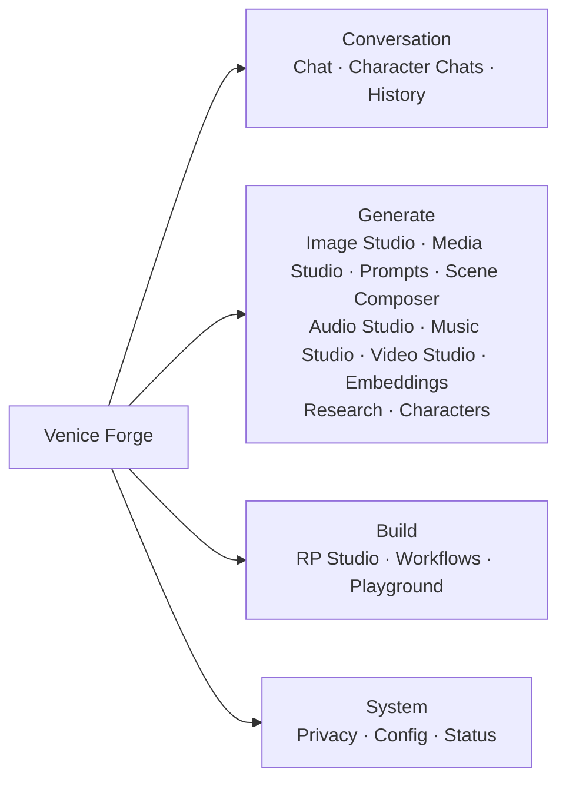

<div align="center">
  <picture>
    <source media="(prefers-color-scheme: dark)" srcset="assets/branding/venice-logo-lockup-white.svg" />
    <source media="(prefers-color-scheme: light)" srcset="assets/branding/venice-logo-lockup-black.svg" />
    
  </picture>
</div>

# Venice Forge

**Unofficial local-first desktop workspace for the Venice API.**

*An advanced frontend client for streaming chat, image studio pipelines, research synthesis, SillyTavern-compatible character authoring, roleplay scripting, and local creative asset management.*

<p align="center">
  <a href="https://github.com/spearchucker667/Venice_Forge/actions/workflows/ci.yml">
    
  </a>
  <a href="https://github.com/spearchucker667/Venice_Forge/releases">
    
  </a>
  <a href="https://github.com/spearchucker667/Venice_Forge/releases">
    
  </a>
  <a href="https://github.com/spearchucker667/Venice_Forge/releases">
    
  </a>
  <a href="LICENSE">
    
  </a>
  <a href="package.json">
    
  </a>
  <a href="tsconfig.json">
    
  </a>
  <a href="package.json">
    
  </a>
</p>

---

> [!IMPORTANT]
> **Venice Forge is an unofficial third-party project.** It is not affiliated with, endorsed by, sponsored by, or maintained by Venice.ai (Venice.ai, Inc.). Venice brand assets, names, and trademark marks are the property of Venice.ai, Inc.

> [!WARNING]
> The `main` branch is active development and may be unstable. Normal users should install a tagged release from [GitHub Releases](https://github.com/spearchucker667/Venice_Forge/releases).

---

## Overview

Venice Forge is an unofficial, local-first creative desktop client for the [Venice API](https://docs.venice.ai). Designed as a premium, secure workspace, it empowers authors, artists, developers, and researchers with advanced local tooling that goes far beyond generic web interfaces.


By prioritizing local data ownership, Venice Forge runs all storage operations locally on your machine—utilizing IndexedDB with AES-GCM encryption in the browser/renderer and secure OS-level keychain boundaries for credentials.

---

## Feature Highlights

- **Local-First Backup & Sync:** Manually export/import encrypted backups, or use a background sync folder (e.g. iCloud, Dropbox) with automated end-to-end encrypted packet syncing and robust conflict resolution. Venice Forge does not implement WebDAV, S3-compatible, or other direct remote-sync protocols.
- **Streaming AI Conversations:** Experience highly responsive model outputs with full Markdown and LaTeX support.
- **Projects & Workspaces:** Organize your chat histories, generation parameters, and media assets into logical local projects.
- **Model-Aware Image Generation:** Image Studio UI dynamically hides fields unsupported by the selected image model, preventing payload errors.
- **Media Studio Command Center:** Gallery view equipped with multi-select bulk operations, lineage graph tracing, visual diff comparison, and metadata-preserving exports.
- **Research Workspace & Embedded Browser:** Synthesize facts using Venice/Jina-backed search, scraping, and social discovery within an isolated sandbox.
- **Prompt Library:** Cleanly version, tags, and reuse system or user prompts with automatic secret filtering on import/export.
- **ST Card Studio & RP Studio:** Create, preview-import, edit, version, test, and verified-export Tavern V1 / Character Card V2 JSON and V2 PNG cards; manage personas, scenarios, lorebooks, multi-character chats, and scene generation from the same local workspace.
- **Token-Based Styling:** Dynamic premium glassmorphism theme system supporting standard dark/light modes and fully custom YAML theme imports.

## Current Workspace Map

The navigation below uses the canonical tab labels from `src/config/tabs.ts`; legacy aliases such as `Library`, `Gallery`, `Batch`, and `Diagnostics` are intentionally absent.



---

## Core App Areas

| Area | Status | Purpose |
| :--- | :---: | :--- |
| **Chat** | Beta | Streaming conversations, projects, prompt injects, attachments, classical/agent modes |
| **Image Studio** | Beta | Model-aware generation, prompt enhancement, image editing, background removal, and API-compliant 2×/4× upscaling |
| **Media Studio** | Beta | Visual gallery, multi-image comparison, lineage tracking, metadata bundle exports |
| **Prompts** | Beta | Prompt Library with global/project scopes, version chains, and Tag manager |
| **Audio/Music/Video** | Experimental | Whisper transcripts, speech generation, lyrics-driven music, and async video queues |
| **Research** | Experimental | Integrated search/scrape runner with Jina and Venice search synthesis |
| **Characters & RP** | Beta | SillyTavern-compatible Card Studio, local cards, personas, lorebooks, multi-character chats, and scene compiler |
| **Workflow Templates** | Experimental | Versioned template-based automation chains; visual graph building remains in Playground |

---

## Research Browser and Jina Research

Venice Forge includes an embedded **Research Browser** that utilizes Electron's native `WebContentsView` architecture rather than dangerous Webviews or iframes.


- **Architectural Isolation:** The renderer-side address bar and toolbar drive an independent, main-process-managed browser view.
- **Security Constraints:** The browser blocks unsafe scheme loads (e.g. `file://`, `data://` from untrusted origins), restricts private subnet access (`127.0.0.1`, `localhost` ranges), enforces a robust CSP, and safely routes standard `target="_blank"` popups.
- **Jina Integration:** The browser is wired into the Venice/Jina scraper. When scraping a page, Jina-backed proxies format clean markdown captures which are screened locally for content safety.
- **Experimental Status:** Because Electron `WebContentsView` geometry and window z-indexing require precise OS-level rendering, the Research Browser is classified as **Experimental** and requires manual headed smoke validation.

---

## Characters, RP Studio, Memory, and Lorebooks

Roleplay and creative writing features are consolidated into a comprehensive **RP Studio**:
- **ST Card Studio:** Create, preview-import, edit, version, test, and verified-export Tavern V1 / Character Card V2 JSON and V2 PNG cards. Main-owned file dialogs, bounded PNG validation, secret filtering, lossless compatibility fields, encrypted local drafts, typed AI refinement proposals, alternate greetings, and embedded lorebook compilation preserve the app’s existing storage and safety boundaries. See [the user guide](docs/user/ST_CARD_STUDIO.md).
- **Authoring workflow:** A ten-step editor covers identity, prompts, greetings, example dialogue, embedded or linked character books, compatibility metadata, generation/refinement proposals, version comparison, and a disposable prompt-traced test turn that can be promoted explicitly into a real conversation.
- **Interoperability limits:** Character Card V3, compressed PNG metadata, embedded V3 assets, bulk ZIP libraries, and extension-specific editors are not supported. See the [compatibility reference](docs/reference/CHARACTER_CARD_V2_COMPATIBILITY.md).
- **Personas & Scenarios:** Manage user identity stacks and contextual background circumstances separately.
- **Lorebooks:** Define key-value triggers that inject world context or character history into the prompt window dynamically.
- **Memory Injection:** Active chats automatically query IndexedDB-backed semantic memories. Injected context is disclosed to users via a collapsible audit pill in the conversation UI.

---

## Image, Media, Audio, Music, Video, and Embeddings

Venice Forge provides a rich multimedia pipeline:
- **Image Generation:** The Image Studio handles prompts, negatives, seeds, aspect ratios, and model-specific parameters.
- **Media Studio:** The gallery indexes all outputs. You can select up to 4 images for a side-by-side field diff comparison, walk the parent-child lineage tree of remixed images, and export a redacted JSON manifest with deterministic sidecar filenames. The current export does not assemble or embed a ZIP/media archive.
- **Audio & Music:** Supports Whisper-powered transcriptions, Text-to-Speech speech queues, and lyrics-driven Music generation.
- **Video:** Queues asynchronous text/image-to-video requests and polls progress cleanly.
- **Embeddings:** Evaluates text strings against available embedding models to inspect raw vector arrays.

---

## Profiles, Privacy, Local Storage, and Secure Credentials

Privacy is the core design pillar of Venice Forge:
- **No Telemetry:** The application does not collect analytics, telemetry, or crash reports.
- **Secure Key Storage:** In Electron, profile-scoped API keys are encrypted with Electron `safeStorage` and the ciphertext is stored in the owner-only `secure-prefs.json` app-data file. `safeStorage` uses Keychain-backed encryption on macOS and DPAPI on Windows. The scoped Windows Credential Manager bridge is reserved for strict password-verifier records; it does not store API keys. Linux fails closed when OS encryption is unavailable unless the documented plaintext fallback is explicitly enabled.
- **Profiles & Isolation:** Profiles separate settings, conversations, and API keys. Locked profiles can be password-protected; PBKDF2-SHA256 verifiers are managed entirely in the main process with a 5-attempt brute-force lockout.
- **Data Redaction:** The Traffic Inspector, application log files, and diagnostics exports automatically strip bearer tokens, API keys (`sk-...`, `vn-...`), local system paths, and raw prompt/response bodies.
- **Local Family Safe Mode:** Run-time guardrails screen outgoing prompts and inbound scrape responses locally. This is independent of the provider-side Venice API `safe_mode`.
- **Fallback Provider Consent:** In Electron, fallback-provider enablement, ordering, and provider-native automatic fallback models are profile-scoped and enforced by the main process; renderer request payloads cannot opt a provider in. Replicate, AWS Bedrock, Google Vertex AI, Azure OpenAI, Hugging Face, and Cohere are explicitly deferred and cannot accept keys or traffic in this release. Provider keys can be manually removed/replaced; scheduled key rotation is not implemented.

---

## Theme System

The user interface uses a token-based styling model matching dynamic glassmorphism aesthetics.
- **YAML Themes:** Built-in and user-supplied themes live under `config/themes/` using standard CSS variable key-value maps.
- **Built-in Catalog (35 Themes):**
  - *Dracula & Dark Palettes:* Basalt Noir, catppuccin, dracula, gruvbox_dark, midnight-velvet, monokai, nord, obsidian-bloom, one_dark, rosepine, solarized_dark, synthwave-harbor, tokyo_night, venice.
  - *Light & High Contrast:* amber-archive, arctic-glass, aurora-boreal, circuit-mint, copper, cyber-orchid, dark, desert-copperfield, ember-monastery, github_light, glacial-ink, harbor-fog, light, moss-circuit, neon-dusk, porcelain-daybreak, sakura-terminal, solar-ash, solarized_light, toxic-limewire, ultraviolet-rain.
- **Visual Parity:** Custom themes automatically style the main workspace, sidebar lists, settings, inputs, and the Research Browser home splash.

---

## Quick Start for Users

1. Download the installer or portable binary for your OS from [GitHub Releases](https://github.com/spearchucker667/Venice_Forge/releases).
2. Install and launch **Venice Forge**.
3. Navigate to the **Config** tab.
4. Input your Venice API Key (and optionally your Jina API Key for advanced web scraping).
5. Click **Test Connection**.
6. Switch back to **Chat** or **Image Studio** to begin.

---

## Developer Setup

Ensure you have Node.js (`>=22.13.0 <23.0.0`) and npm (`>=10.0.0`) installed.

```bash
# Clone the repository
git clone https://github.com/spearchucker667/Venice_Forge.git
cd Venice_Forge

# Install dependencies exactly
npm ci

# Launch desktop development mode (Electron with Vite HMR)
npm run dev:electron
```

To run in **Web-only proxy mode** (useful for server setups or browser testing):
```bash
# Start concurrently (Express proxy server + Vite dev server)
npm run dev
```

---

## Validation / CI Gates

Before submitting a pull request, you must verify that all linting, typing, tests, and contract verifications pass:

```bash
# 1. Run ESLint (zero warnings enforced)
npm run lint:eslint

# 2. Run TypeScript compiler typechecks
npm run typecheck

# 3. Run full Vitest suite serially
npm test

# 4. Run safety, markdown links, and other local contract checks
npm run verify:contracts

# 5. Build production bundles
npm run build

# 6. Verify release packaging hardening (Phase 2J) and dist output
npm run verify:release-packaging-hardening
npm run verify:dist
```

Release-readiness is enforced by `verify:release-packaging-hardening` (Phase 2J / VERIFY-052) and the `verify:dist` build-output gate. Maintainers must run `npm run verify:contracts` and `npm run verify:dist` before tagging a release, in addition to the steps above.

---

## Repository Map

For a complete breakdown of every file, see [FILE_TREE.md](docs/FILE_TREE.md). Below is the high-level outline:

```text
.
├── electron/              # Main process, preload, IPC, native OS services
│   ├── ipc/               # IPC handlers partitioned by domain
│   └── services/          # Secure storage, logger, updater, guard pipelines
├── src/                   # React renderer, stores, services, visual views
│   ├── components/        # UI views (chat, image, media, settings, etc.)
│   ├── services/          # Venice API client, export, IndexedDB adapters
│   ├── stores/            # Zustand 5 slice stores (auth, settings, media)
│   └── theme/             # Token mappings, built-in YAML palettes, apply helpers
├── config/themes/         # Built-in YAML theme definitions
├── public/                # Static assets and browser default home page
├── docs/                  # Design, release, development, and legal docs
├── scripts/               # Build, verify, release, and hygiene scripts
├── tests/                 # Playwright smoke tests and accessibility suites
└── package.json           # Scripts, engines, and dependencies
```

---

## Configuration

Local overrides can be declared in YAML format. The app will search for `.config/config.yaml` or `.config/config.local.yaml` (which are gitignored to prevent credential leaks).

```bash
# Initialize local configuration files from templates
npm run config:init

# Print the sanitized effective configuration
npm run config:print
```

Refer to [CONFIG.md](docs/DEVELOPMENT/CONFIG.md) for a detailed list of configuration keys.

---

## Legal, Privacy, Safety, and Abuse Policy

- **Unofficial Status:** Venice Forge is an independent frontend wrapper. Venice.ai does not offer direct support for this client.
- **Abuse Prohibitions:** Venice Forge must not be used to facilitate illegal content generation or harassment.
- **Vulnerability Disclosures:** Report security flaws or potential data leaks privately via GitHub Vulnerability Reporting.
- **Full Terms:** Read [LEGAL.md](LEGAL.md) and [PRIVACY.md](PRIVACY.md).

---

## Contributing

We welcome community enhancements. Please review [CONTRIBUTING.md](CONTRIBUTING.md) and ensure all validation checks pass locally before opening a pull request.

---

## Support

For issues with this client application, please open an issue on our [GitHub Tracker](https://github.com/spearchucker667/Venice_Forge/issues). For API account, token billing, or model-level concerns, refer to official [Venice.ai Support](https://venice.ai/support). See also [SUPPORT.md](SUPPORT.md).

---

## License

Venice Forge is open-source software licensed under the [MIT License](LICENSE).
