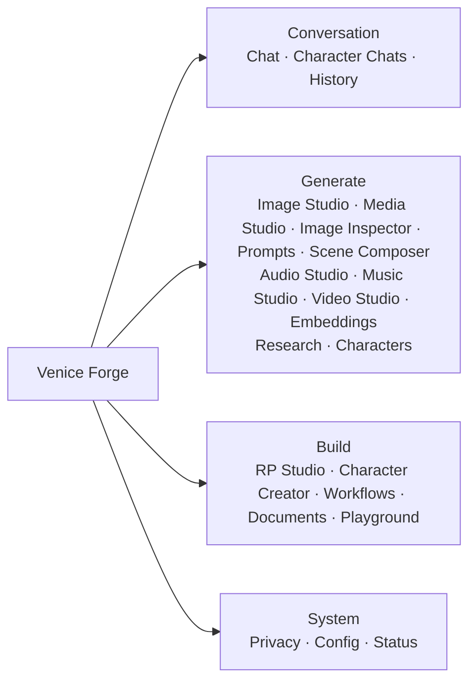

<div align="center">
  <picture>
    <source media="(prefers-color-scheme: dark)" srcset="assets/branding/venice-logo-lockup-white.svg" />
    <source media="(prefers-color-scheme: light)" srcset="assets/branding/venice-logo-lockup-black.svg" />
    
  </picture>
</div>

# Venice Forge

**Unofficial local-first desktop workspace for the Venice API.**

*An advanced frontend client for streaming chat, image studio pipelines, video & music generation, research synthesis, SillyTavern-compatible character authoring, roleplay scripting, visual workflows, and local creative asset management.*

<p align="center">
  <a href="https://github.com/spearchucker667/Venice_Forge/actions/workflows/ci.yml">
    
  </a>
  <a href="https://github.com/spearchucker667/Venice_Forge/releases">
    
  </a>
  <a href="https://github.com/spearchucker667/Venice_Forge/releases">
    
  </a>
  <a href="https://github.com/spearchucker667/Venice_Forge/releases">
    
  </a>
  <a href="https://github.com/spearchucker667/Venice_Forge/releases">
    
  </a>
  <a href="LICENSE">
    
  </a>
  <a href="package.json">
    
  </a>
  <a href="tsconfig.json">
    
  </a>
  <a href="package.json">
    
  </a>
</p>

---

<p align="center">
  
</p>

---

> [!IMPORTANT]
> **Venice Forge is an unofficial third-party project.** It is not affiliated with, endorsed by, sponsored by, or maintained by Venice.ai (Venice.ai, Inc.). Venice brand assets, names, and trademark marks are the property of Venice.ai, Inc.

> [!WARNING]
> `main` is under active development and may be unstable. It can contain incomplete features, schema migrations, experimental UI, and breaking changes between commits. For production use, install a tagged [GitHub Release](https://github.com/spearchucker667/Venice_Forge/releases).

---

## Languages

- [English](README.md)
- [Español](docs/i18n/es/README.md)
- [Français](docs/i18n/fr/README.md)
- [Deutsch](docs/i18n/de/README.md)
- [Português do Brasil](docs/i18n/pt-BR/README.md)
- [Русский](docs/i18n/ru/README.md)
- [简体中文](docs/i18n/zh-CN/README.md)
- [日本語](docs/i18n/ja/README.md)
- [हिन्दी](docs/i18n/hi/README.md)
- [العربية](docs/i18n/ar/README.md)
- [한국어](docs/i18n/ko/README.md)
- [Svenska](docs/i18n/sv-SE/README.md)

English is the canonical source language. All 12 bundled catalogs have complete
runtime-surface coverage, including Arabic RTL behavior. The 11 non-English
catalogs are first-pass machine translations and remain marked
production-incomplete until qualified native reviewers record dated approval.

---

## Overview

Venice Forge is an unofficial, local-first creative desktop client for the [Venice API](https://docs.venice.ai). Designed as a premium, secure workspace, it empowers authors, artists, developers, and researchers with advanced local tooling that goes far beyond generic web interfaces.

By prioritizing local data ownership, Venice Forge keeps application data on your machine. Renderer state uses local browser storage, encrypted backup archives protect exported data, and Electron credentials use the operating system's secure storage boundary.

---

## Feature Highlights

- **Multi-Language Runtime:** Twelve bundled catalogs cover the complete application surface, with instant switching, persisted selection, locale-aware formatting, and Arabic RTL layout. English is source-complete; the other catalogs are clearly identified as first-pass translations pending native review.
- **Local-First Backup & Sync:** Manually export/import encrypted `.vfbackup` archives, or use a background sync folder (e.g. iCloud, Dropbox) with automated end-to-end encrypted packet syncing and robust conflict resolution.
- **Streaming AI Conversations:** Experience responsive model outputs with full Markdown, LaTeX math rendering, prompt-limit enforcement, and attachment context.
- **Projects & Workspaces:** Organize your chat histories, generation parameters, and media assets into logical local projects.
- **Document Tools & Workspace Grants:** Create non-overwriting managed documents, review exact edit diffs, retain immutable revisions, search text files across granted workspace directories, and export through native save boundaries.
- **Model-Aware Image Generation:** Image Studio adapts inputs to selected model capabilities and uses endpoint-correct payloads across generation, edit, inpaint, background removal, and API-compliant 2×/4× upscaling. Generated desktop images are verified and persisted through the main-owned media store, with explicit retry and Save As recovery when local storage fails.
- **Image Inspector & Prompt Reconstruction:** Analyze PNG, JPEG, or WebP images with a selected vision model and generate structured visual breakdowns and target-specific replication prompts. Direct image-based web matching remains provider-blocked; the former query-derived action is disabled.
- **Media Studio Command Center:** Gallery view equipped with multi-select bulk operations, lineage graph tracing, visual diff comparison, and metadata-preserving exports.
- **Video & Music Studios:** Queue text/image-to-video and lyrics-driven music requests with explicit stage tracking (`queued` → `generating` → `retrieving` → `saving` → `completed`), durable stream persistence, and MP4/audio exports.
- **Research Workspace:** Synthesize facts using Venice/Jina-backed search, web scraping, and social discovery within an isolated sandbox.
- **Prompt Library & Scene Composer:** Version, tag, and reuse prompts; arrange prompts, media references, and models into structured visual scene compositions.
- **ST Card Studio, Character Creator & RP Studio:** Turn rough ideas into complete, editable character cards with the configured authoring model; view event-driven design decisions; create, preview-import, edit, version, test, and verified-export Tavern V1 / Character Card V2 JSON and V2 PNG cards; manage personas, scenarios, lorebooks, multi-character chats, and scene generation.
- **Playground & Workflow Editor:** Interactive visual node graph builder for constructing and running multi-modal AI task chains.
- **Token-Based Styling:** Dynamic token-based glassmorphism theme system supporting 43 built-in themes plus custom YAML palette imports.

---

## Navigation Overview

The navigation below uses the canonical tab labels from `src/config/tabs.ts`:


```mermaid
flowchart LR
  VF["Venice Forge"]
  VF --> Conversation["Conversation<br/>Chat · Character Chats · History"]
  VF --> Generate["Generate<br/>Image Studio · Media Studio · Image Inspector · Prompts · Scene Composer<br/>Audio Studio · Music Studio · Video Studio · Embeddings<br/>Research · Characters"]
  VF --> Build["Build<br/>RP Studio · Character Creator · Workflows · Documents · Playground"]
  VF --> System["System<br/>Privacy · Config · Status"]
```

---

## Current Workspace Map

| Area | Status | Purpose |
| :--- | :---: | :--- |
| **Chat** | Beta | Streaming conversations, projects, prompt injects, attachments, classical/agent modes |
| **Character Chats** | Beta | Conversation-scoped hosted/local character chats with isolated identity and greeting ownership |
| **History** | Beta | Browse, restore, organize, and inspect saved conversation state |
| **Image Studio** | Beta | Model-aware generation, prompt enhancement, image editing, background removal, 2×/4× upscaling, and recoverable durable desktop persistence |
| **Media Studio** | Beta | Main-owned generated-media custody, visual gallery, multi-image comparison, lineage tracking, integrity-gated Save As, and metadata bundle exports |
| **Image Inspector** | Beta | Bounded local-image ingestion, schema-validated visual analysis, target-specific replication prompts, deletable inspection history, and live model pricing |
| **Prompts** | Beta | Prompt Library with global/project scopes, version chains, and tag management |
| **Scene Composer** | Beta | Visual composition tool for arranging prompts, media references, and models into scenes |
| **Audio Studio** | Beta | TTS speech generation with voice selection and configurable audio response formats |
| **Music Studio** | Beta | Lyrics-driven music generation, duration control, and instrumental toggle |
| **Video Studio** | Beta | Asynchronous text/image-to-video queues, stage tracking, durable stream persistence, and MP4 exports |
| **Embeddings** | Beta | Text vector array inspection and model evaluation |
| **Research** | Beta | Integrated search/scrape runner with Jina and Venice search synthesis |
| **Characters & RP** | Beta | SillyTavern-compatible ST Card Studio, local cards, personas, lorebooks, and multi-character chats |
| **Character Creator** | Beta | AI-assisted character authoring pipeline with visible event-driven design process decisions and local library persistence |
| **RP Studio** | Beta | Standalone scenarios, openers, setting text, and character card seeding |
| **Workflows** | Beta | Versioned template-based automation chains |
| **Playground** | Beta | Interactive visual node graph builder and multi-model workflow execution engine |
| **Documents** | Beta | Managed-document tools, immutable revisions, workspace search/inspection, and directory grants |
| **Privacy** | Beta | Local storage inventory, encrypted backup/sync controls, safe summaries, and maintenance actions |
| **Config** | Beta | Credentials, providers, language/region, themes, safety, backup/sync, and application settings |
| **Status** | Beta | Diagnostics, task activity, connectivity, rate limits, and redacted log access |

---

## Research and Jina

The supported Research workspace provides Venice/Jina search, page scraping, AI synthesis, citations, saved sessions, document upload, findings, summaries, and prompt/workflow handoffs. The former embedded Research Browser is inactive; its implementation is retained only under `inactive-features/research-browser/` and is not imported, tested, bundled, or packaged.

---

## Characters, RP Studio, Memory, and Lorebooks

Roleplay and creative writing features are consolidated into a comprehensive **RP Studio**:
- **ST Card Studio:** Create, preview-import, edit, version, test, and verified-export Tavern V1 / Character Card V2 JSON and V2 PNG cards. Main-owned file dialogs, bounded PNG validation, secret filtering, lossless compatibility fields, encrypted local drafts, typed AI refinement proposals, alternate greetings, and embedded lorebook compilation preserve the app’s existing storage and safety boundaries. See [the user guide](docs/user/ST_CARD_STUDIO.md).
- **Authoring workflow:** A ten-step editor covers identity, prompts, greetings, example dialogue, embedded or linked character books, compatibility metadata, generation/refinement proposals, version comparison, and a disposable prompt-traced test turn that can be promoted explicitly into a real conversation.
- **Interoperability limits:** Character Card V3, compressed PNG metadata, embedded V3 assets, bulk ZIP libraries, and extension-specific editors are not supported. See the [compatibility reference](docs/reference/CHARACTER_CARD_V2_COMPATIBILITY.md).
- **Personas & Scenarios:** Manage user identity stacks and contextual background circumstances separately.
- **Lorebooks:** Define key-value triggers that inject world context or character history into the prompt window dynamically.
- **Memory Injection:** Active chats automatically query IndexedDB-backed semantic memories. Injected context is disclosed to users via a collapsible audit pill in the conversation UI.

---

## Image, Media, Audio, Music, Video, and Embeddings

Venice Forge provides a rich multimedia pipeline:
- **Image Generation:** Image Studio handles prompts, negatives, seeds, aspect ratios, and model-specific parameters. Desktop results are MIME/signature checked, written as SHA-256-addressed `venice-media://` blobs through main-frame-only IPC, and verified after persistence. If the primary store is full, read-only, or temporarily unavailable, the app retains a bounded process-local recovery copy, displays **Retry Save**, and lets the user choose another destination with native Save As.
- **Image Inspection:** Image Inspector accepts bounded PNG, JPEG, and WebP inputs, uses live model capability metadata to select vision models and display pricing, validates structured analysis before persistence, and produces prompts for Generic Natural Language, Venice Image Studio, FLUX, or Midjourney. Saved inspections can be deleted independently of Media Studio images. Direct source-image Google/Brave matching is not exposed because the configured contracts accept text queries rather than image bytes. See the [Image Inspector guide](docs/user/IMAGE_INSPECTOR.md).
- **Media Studio:** The gallery indexes all outputs. You can select up to 4 images for a side-by-side field diff comparison, walk the parent-child lineage tree of remixed images, and export a redacted JSON manifest with deterministic sidecar filenames.
- **Audio & Music:** Supports Text-to-Speech speech queues and lyrics-driven Music generation.
- **Video:** Queues asynchronous text/image-to-video requests, shows explicit queued/generating/retrieving/saving stages, streams completed MP4 bytes into main-owned durable storage, and exports through a native Save As boundary.
- **Embeddings:** Evaluates text strings against available embedding models to inspect raw vector arrays.

---

## Profiles, Privacy, Local Storage, and Secure Credentials

Privacy is the core design pillar of Venice Forge:
- **No Telemetry:** The application does not collect analytics, telemetry, or crash reports.
- **Secure Key Storage:** In Electron, profile-scoped API keys are encrypted with Electron `safeStorage` and the ciphertext is stored in the owner-only `secure-prefs.json` app-data file (`safeStorage` uses Keychain-backed encryption on macOS and DPAPI on Windows; password-verifier records protect profile passwords, and it does not store API keys in plaintext).
- **Profiles & Isolation:** Profiles separate settings, conversations, and API keys. Locked profiles can be password-protected; password-verifier records and PBKDF2-SHA256 verifiers are managed entirely in the main process with a 5-attempt brute-force lockout.
- **Data Redaction:** The Traffic Inspector, application log files, and diagnostics exports automatically strip bearer tokens, API keys (`sk-...`, `vn-...`), local system paths, and raw prompt/response bodies.
- **Generated-media custody:** Desktop gallery records contain stable media IDs and `venice-media://` URLs rather than full image data URLs. Recovery custody is main-process-only, bounded to eight items / 128 MiB / 30 minutes, and contains media bytes plus integrity metadata—never prompts, credentials, or renderer-selected paths.
- **Local Family Safe Mode:** Run-time guardrails screen outgoing prompts and inbound scrape responses locally. This is independent of the provider-side Venice API `safe_mode`.

---

## Theme System (Theme Engine V2)

The user interface uses a token-based styling model matching dynamic glassmorphism aesthetics.
- **YAML Themes:** Built-in and user-supplied themes live under `config/themes/` using standard CSS variable key-value maps.
- **Theme-Aware Syntax Highlighting:** Fenced and inline code blocks are dynamically syntax-highlighted with color palettes matched to the active theme via a 33-token code theme contract.
- **Theme Maker:** Create, customize, and preview themes in real time, including a dedicated Code & Syntax palette editor.
- **Built-in Catalog (43 Themes):**
  - *Pastel Aqua/Pink Theme Pack:* cotton-candy-console, sweet-nightmare, dual-persona, polaroid-board.
  - *Dracula & Dark Palettes:* basalt-noir, catppuccin, dracula, gruvbox_dark, midnight-cobalt, midnight-velvet, monokai, nord, obsidian-bloom, obsidian-ember, one_dark, rosepine, solarized_dark, synthwave-harbor, terminal-forest, tokyo_night, venice.
  - *Light & High Contrast:* amber-archive, arctic-glass, aurora-boreal, circuit-mint, copper, cyber-orchid, dark, desert-copperfield, ember-monastery, github_light, glacial-ink, harbor-fog, light, moss-circuit, neon-dusk, polaroid-board, porcelain-daybreak, porcelain-sky, sakura-terminal, sandstone, solar-ash, solarized_light, toxic-limewire, ultraviolet-rain.

---

## Documentation

Venice Forge documentation follows the [Diátaxis](https://diataxis.fr) framework (tutorials, how-to guides, reference, and explanation) and is indexed centrally in [`docs/DOCS_INDEX.md`](docs/DOCS_INDEX.md).

- **[Documentation Index](docs/DOCS_INDEX.md)** — Canonical navigation map for all project documentation.
- **[About Venice Forge](docs/ABOUT.md)** — Architecture, philosophy, core features, and data flow.
- **[Frequently Asked Questions](docs/FAQ.md)** — Privacy, safety, storage, API compatibility, and troubleshooting.
- **[Contributing Guide](CONTRIBUTING.md)** — Code conventions, validation commands, and pull request checklist.
- **[Agent Instructions](AGENTS.md)** — Guidelines, authority order, and safety rules for AI coding assistants.
- **[API Reference](docs/reference/Venice_swagger_api.yaml)** — Bundled OpenAPI specification for the Venice API.
- **[Repository Maintenance & Hygiene](docs/repository-maintenance/README.md)** — Repository organization policies, hygiene report, and file manifests.

---

## Quick Start for Users

1. Download the installer or portable binary for your OS from [GitHub Releases](https://github.com/spearchucker667/Venice_Forge/releases).
2. Install and launch **Venice Forge**.
3. Navigate to the **Config** tab.
4. Input your Venice API Key (and optionally your Jina API Key for advanced web scraping).
5. Click **Test Connection**.
6. Switch back to **Chat** or **Image Studio** to begin.

---

## Developer Setup

Ensure you have Node.js (`>=22.15.0 <23.0.0`) and npm (`>=10.0.0`) installed. The repository pins Node.js through `.nvmrc`; use Node 22 for local and CI parity.

```bash
# Clone the repository
git clone https://github.com/spearchucker667/Venice_Forge.git
cd Venice_Forge

# Install dependencies exactly
npm ci

# Launch desktop development mode (Electron with Vite HMR)
npm run dev:electron
```

To run in **Web-only proxy mode** (useful for server setups or browser testing):
```bash
# Start concurrently (Express proxy server + Vite dev server)
npm run dev
```

---

## Validation / CI Gates

Before submitting changes, verify that linting, typing, tests, contracts, and production builds pass:

```bash
# 1. Run ESLint (zero warnings enforced)
npm run lint:eslint

# 2. Run TypeScript compiler typechecks
npm run typecheck

# 3. Run full Vitest suite serially
npm test

# 4. Run safety, markdown links, and other local contract checks
npm run verify:contracts

# 5. Build production bundles
npm run build

# 6. Verify release packaging hardening and dist output
npm run verify:release-packaging-hardening
npm run verify:dist

# Localization integrity and zero-hardcoded-prose regression gates
npm run verify:i18n
npm run verify:i18n-hardcoded-regressions

# Complete CI-equivalent gate, including coverage and feature contracts
npm run test:ci
```

---

## Repository Map

For a complete breakdown of every file, see [FILE_TREE.md](docs/DEVELOPMENT/FILE_TREE.md). Below is the high-level outline:

```text
.
├── electron/              # Main process, preload, IPC, native OS services
│   ├── agent/             # Document Agent execution, approval, and workspace services
│   ├── ipc/               # Typed IPC handlers partitioned by domain
│   └── services/          # Secure storage, logger, updater, guard pipelines
├── src/                   # React renderer, stores, services, visual views
│   ├── components/        # UI views (chat, image, media, settings, etc.)
│   ├── services/          # Venice API client, desktop bridge, IndexedDB adapters
│   ├── stores/            # Zustand 5 slice stores (chat, settings, media, etc.)
│   └── theme/             # Token mappings, syntax highlighting, apply helpers
├── assets/                # Repository branding and preview media
├── config/                # Built-in YAML theme definitions and i18n baselines
├── docs/                  # Diátaxis documentation, DOCS_INDEX, maintenance, and legal
├── inactive-features/     # Archived inactive features (research-browser)
├── public/                # Static web assets served by Vite/Express
├── scripts/               # Build, verify, release, and hygiene scripts
├── tests/                 # Playwright smoke tests, contract suites, and invariants
├── package.json           # Scripts, engines, and dependencies
├── .editorconfig          # Repository-wide code formatting rules
├── .gitattributes         # Line endings and binary file declarations
└── .gitignore             # Hardened ignore rules for untracked artifacts
```

---

## Legal, Privacy, Safety, and Abuse Policy

- **Unofficial Status:** Venice Forge is an independent frontend wrapper. Venice.ai does not offer direct support for this client.
- **Abuse Prohibitions:** Venice Forge must not be used to facilitate illegal content generation or harassment.
- **Vulnerability Disclosures:** Report security flaws or potential data leaks privately via GitHub Vulnerability Reporting.
- **Full Terms:** Read [LEGAL.md](LEGAL.md) and [PRIVACY.md](PRIVACY.md).

---

## License

Venice Forge is open-source software licensed under the [MIT License](LICENSE).
